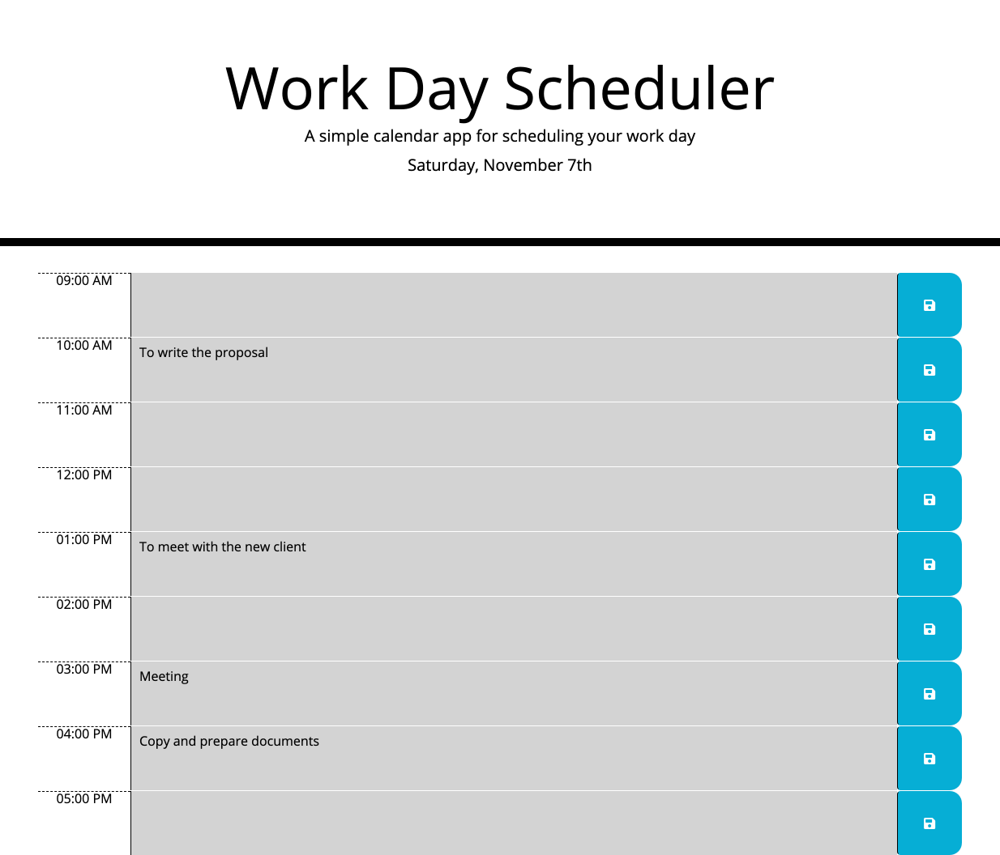

# Work-Day-Scheduler

## Task

The purpose of this assignment is to create a day planner for users who with the busy schedules to note down their important events. This web application goes from 9:00 AM to 5:00 PM, which is the typical time period for people usually to work. Each time block will also have different colors as indicators to let users know whether the current time is past, present, or future. App is powered by jQuery and Moment.js Library.

## Acceptance Criteria

```
GIVEN I am using a daily planner to create a schedule
WHEN I open the planner
THEN the current day is displayed at the top of the calendar
WHEN I scroll down
THEN I am presented with timeblocks for standard business hours
WHEN I view the timeblocks for that day
THEN each timeblock is color coded to indicate whether it is in the past, present, or future
WHEN I click into a timeblock
THEN I can enter an event
WHEN I click the save button for that timeblock
THEN the text for that event is saved in local storage
WHEN I refresh the page
THEN the saved events persist
```

## Appearance and Functionality

Below are the appearance when a user mark down the duties on this app:



## URL sources

Feel free to check the web application: [https://ywen26.github.io/Work-Day-Scheduler/](https://ywen26.github.io/Work-Day-Scheduler/)

And github repository: [https://github.com/ywen26/Work-Day-Scheduler](https://github.com/ywen26/Work-Day-Scheduler)